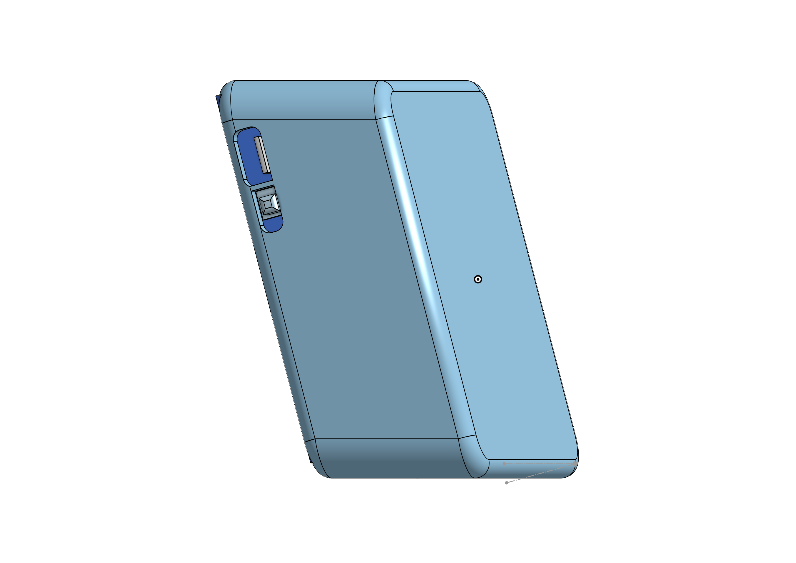

# MoodLight Project

This device aims to build a cozy, or inspirational, or emotive ambient surrounding you. For that, it uses a colorful 8x8 LED matrix to blast you with the mood.
It finds the right mood to transmit thanks to the information acquired by the sensors: temperature*, humidity*, light* and sound level*, detected BT* or WiFi* devices, weather forecast*, etc..
The set of colors, the visual pattern effect and brightness intensity are selected to create the perfect ambient.

(* planned integration)

## Used components

    . LilyGo T7 v1.3 ESP32 MCU,
    . WS2812 LED 5050 RGB 8x8 64 LED Matrix,
    . 18650 LiPo battery charger (embeded in the T7),
    . TP4056 battery charger module (embeded in the T7),
    . 1 Button (embeded in the T7),
    . BME 280 temperature and humidity sensor, *
    . Electret Microphone module, *
    . Light sensor resistor (LDR), * 
        (* Future integration)

## Supported Features

    1. Device should run locally, even when LAN (WiFi) newtork is down
    2. Auto-select the right "mood" profile, based on sensor's reading
    3. Manual selection of "mood" profile.
    4. Auto-OFF Timer, configurable Home Assistant (using the buttons*) and the LED matrix as "output"
    5. Light intensity adjust based on ambient lighting

## Technical Requirements

    - Define "Mood Profiles" with predifined name, color selection (may have diferent number of colors), effect pattern (Led to light-up, color to apply)

    - Use push buttons with single press, or n presses, or long press.

    - Use the matrix as output display, like timer definition, selected EFX, etc. Ex.: each led may represent 5 minutes of the ON timer, or flash green for "OK", or draw a red cross for "NOK" or "Cancel" message.

    - Battery powered to take it anywhere

    - Handy flash light (White color full brightness)

## Case
https://cad.onshape.com/documents/a11340a8b514efb50a936062/w/a1de64b26606eb292ac9daf7/e/f47711be4b7f09a631f87059

